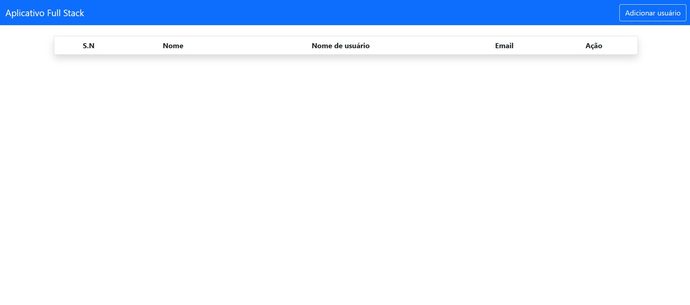
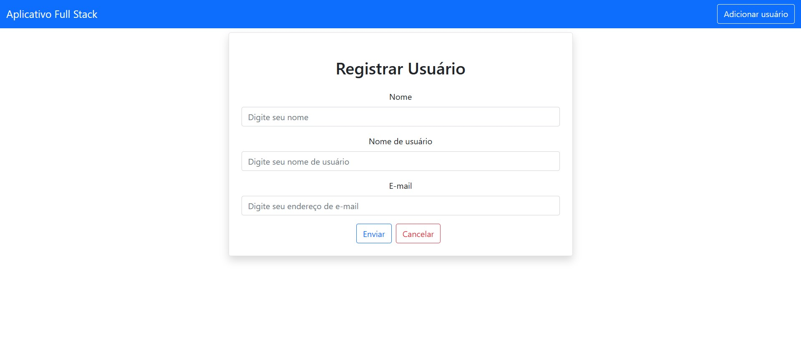
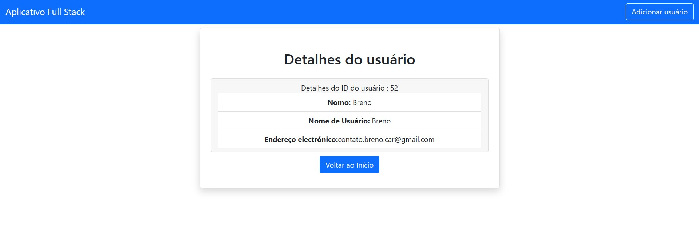
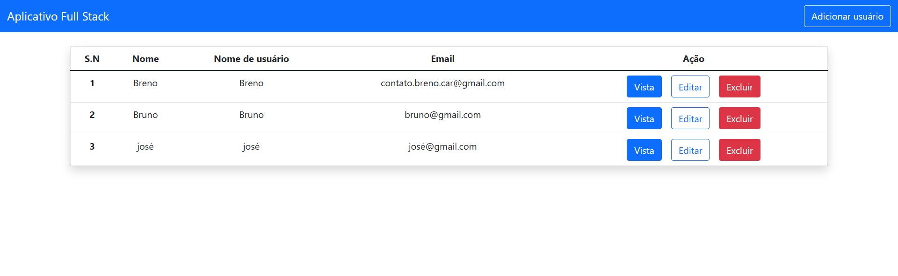
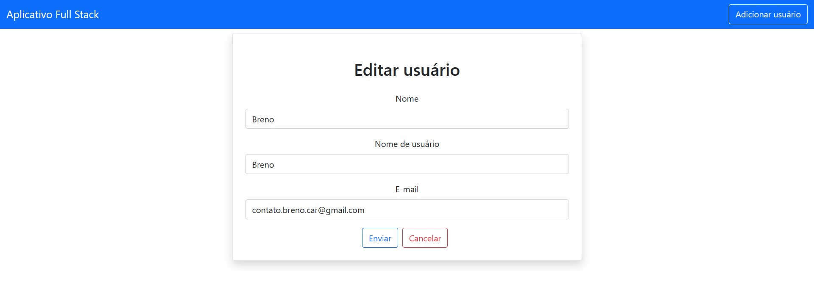

# Aprendendo JAVA backend

## 👀 Como ficou o frontend ???

</img>
----------
</img>
----------
</img>
----------
</img>
----------
</img>

## ⌨️ Sobre o projeto

O projeto consiste numa api java , Ele foi criado utilizando [Spring Boot](https://start.spring.io/).

## Sobre a API

- Método GET -> /users (retorno todos os usuários)
- Método GET -> /user/{id} (retorno o usuário do id)
- Método POST -> /user (cria o usuário)
- Método PUT -> /user/{id} (edita o usuárrio)
- Método DELETE -> /user/{id} (exclui o usuário)

## 🧑‍💻 Tecnologias usadas

O projeto foi desenvolvido com as seguintes tecnologias:
- [Java](https://www.java.com/pt-BR/)
- [MYSQL](https://www.mysql.com/)

